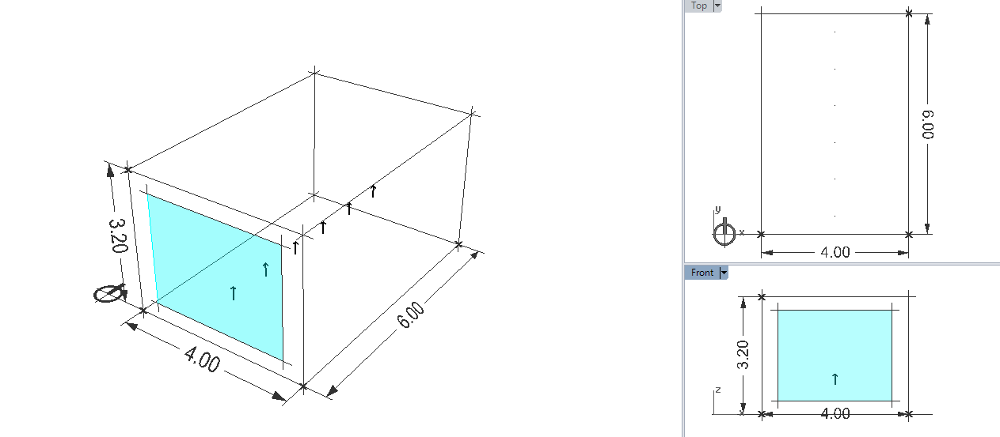

## What is this folder
    This folder is a test room to be used for unittests.

## How to use this folder:

- Files in this folder are created to be used for testing.
- Do not rename or remove the files as these files are referenced by name in
    test files and by renaming the files you will break the tests.
- If you can't find the file that you need for testing, add your file with a
    descriptive name so other developers can also use it for similar cases.
- execute all your test cases in ./testrun subfolder and make sure to delete
    the results file in tearDown method in unittest class.
- use relative path in your test cases so the test case runs fine on other
   machines.

   check out tests/radiance_oconv_test.py for an example.

## List of files

### room.rad
    Radiance file for a simple room with a window on the south side.
    The room is 4m * 6m * 3.2m.

### room.mat
    Radiance material files.

### uniform.sky
    A uniform CIE sky

### room.oct
    A freezed octree file generated from (uniform.sky, room.mat, room.rad)

### indoor_points.pts
    List of 6 points inside the room.
    The first point is 0.5 meter inside the room close to the window at z=0.8
    The rest of the points are located every 1m inside the room.

### facade_points.pts
    List of 5 points for each facade of the room except for ground. The points
    are located in these center of each face and looking outwards. The order of
    points is anit-clockwise starting from south. Last point is located in the
    center of the roof.
    [south, east, north, west, roof]
